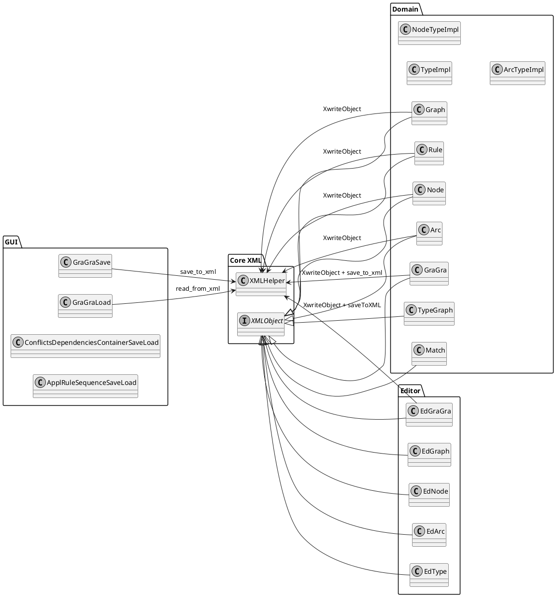

# 📁 AGG XML Serialization Extraction - Complete Refactoring Plan (Part 1)


---

## 🎯 Document Information

- **Project**: AGG (Attributed Graph Grammar System)
- **Objective**: Complete extraction of XML serialization into a separate, independent module
- **Version**: 1.0
- **Date**: 2026-09-07
- **Total Parts**: 3 (due to file size limitations)

---

## 📋 Table of Contents (Complete Series)

### Part 1 (This Document)
1. [Executive Summary](#-executive-summary)
2. [Current State Analysis](#-current-state-analysis)
3. [Target Architecture](#-target-architecture)
4. [Migration Strategy](#-migration-strategy)
5. [Phase 1: Preparation (Week 1-2)](#1️⃣-phase-1-preparation-week-1-2)
6. [Phase 2: XML Module Skeleton (Week 3-4)](#2️⃣-phase-2-xml-module-skeleton-week-3-4)

### Part 2
7. [Phase 3: Core Infrastructure (Week 5-7)](#)
8. [Phase 4: Adapter Layer (Week 8-12)](#)
9. [Phase 5: Migration of Save/Load Classes (Week 13-15)](#)

### Part 3
10. [Phase 6: Domain Object Migration (Week 16-20)](#)
11. [Phase 7: Testing & Validation (Week 21-22)](#)
12. [Phase 8: Cleanup & Optimization (Week 23-24)](#)
13. [Phase 9: Final Cutover (Week 25)](#)
14. [Rollback Plan](#)
15. [Appendices](#)

---

## 🎯 Executive Summary

### Problem Statement

The AGG project has **tight coupling** between domain objects and XML serialization:
- **~95 classes** implement `XMLObject` interface with `XwriteObject()`/`XreadObject()` methods
- Direct dependency on `XMLHelper` in domain classes (Graph, Rule, Node, Arc, etc.)
- **Distributed serialization logic** across ~95 classes
- **No separation of concerns**: Domain logic mixed with I/O concerns
- **Circular dependencies**: Domain → XMLHelper → Domain
- High maintenance cost and difficult testing

### Solution: Adapter Pattern + Separate Module

```
BEFORE:                          AFTER:
┌─────────────┐                  ┌─────────────┐     ┌─────────────────┐
│ Domain Class │────XMLHelper───►│ XMLHelper   │     │   XML Module    │
│ (Graph)      │                  │ (in agg-core)│     │ (agg-xml)       │
└─────────────┘                  └─────────────┘     │                 │
                                           │         │                 │
┌─────────────┐                  ┌─────────────┐     │  ┌───────────┐  │
│ Domain Class │────XMLHelper───►│ XMLHelper   │     │  │ XMLObject │  │
│ (Node)       │                  │             │     │  │ Adapter   │◄─┘
└─────────────┘                  └─────────────┘     │  └───────────┘  │
                                           │         │                 │
                      TIGHT COUPLING             │    ┌───────────┐  │
                                           │         │  │ Serializer│  │
                                           │         │  └───────────┘  │
                                           │         └─────────────────┘
                                           │
                              DEPENDENCY CHAOS
```

### Key Principles

1. **Zero Changes to Domain Classes**: Graph, Rule, Node, Arc remain **completely unchanged**
2. **Backward Compatibility**: All existing .ggx files must remain readable/writable
3. **Adapter Pattern**: Bridge between old XMLObject interface and new XMLSerializable interface
4. **Gradual Migration**: Step-by-step replacement with feature flags for rollback

### Success Criteria

- [ ] All existing .ggx files can be loaded with new system
- [ ] All objects can be saved and loaded without data loss
- [ ] Domain classes have **zero imports** from XML module
- [ ] All tests pass (existing + new)
- [ ] Performance metrics show no significant degradation
- [ ] XML module can be developed/tested independently

---

## 🏗️ Current State Analysis

### Architecture Problems

| Issue | Impact | Current State |
|-------|--------|---------------|
| Tight coupling domain ↔ XML | High maintenance | ~95 classes implement XMLObject |
| Distributed serialization logic | Hard to maintain | Each class has XwriteObject/XreadObject |
| No separation of concerns | SOLID violation | Domain classes call XMLHelper directly |
| Circular dependencies | Complex builds | Domain → XMLHelper → Domain |
| Difficult to test | Low coverage | No isolated XML tests |

### Key Files Inventory

#### Core XML Classes
```
agg/util/
├── XMLHelper.java          # 1450+ lines, central XML processing
└── XMLObject.java          # Interface with 2 methods

# XMLHelper Key Methods:
- save_to_xml(String)          # Main save method
- read_from_xml(String)        # Main load method
- addTopObject(Object)        # Add object to serialize
- addObject(String, Object, boolean)
- openObject(Object, Object)
- loadObject(XMLObject)       # Load into template
- getTopObject(XMLObject)     # Load top-level object
- readSubTag(String)          # Navigate XML
- close()                    # Close current element
```

#### XMLObject Implementations (95+ classes)

**agg.xt_basis package (20 classes):**
- Graph, Rule, Node, Arc, GraGra, TypeGraph, Match, TypeImpl, NodeTypeImpl, ArcTypeImpl, GraphObject (abstract), ...

**agg.attribute.impl package (10 classes):**
- ValueTuple, VarTuple, CondTuple, DeclTuple, ValueMember, CondMember, DeclMember, ...

**agg.parser package (15 classes):**
- ConflictsDependenciesContainer, DependencyPairContainer, ExcludePairContainer, LayeredDependencyPairContainer, LayeredExcludePairContainer, PriorityDependencyPairContainer, PriorityExcludePairContainer, LayerFunction, ...

**agg.editor.impl package (30 classes):**
- EdGraGra, EdGraph, EdNode, EdArc, EdType, EdRule, EdRuleScheme, EdAtomic, EdConstraint, EdNestedApplCond, ...

**agg.cons package (5 classes):**
- Formula, AtomConstraint, ...

**agg.ruleappl package (5 classes):**
- ApplRuleSequence, ...

**agg.gui.* packages (10 classes):**
- ConflictsDependenciesContainerSaveLoad, ApplRuleSequenceSaveLoad, ...

### Save/Load Classes (Application Layer)

**agg.gui.saveload package:**
- GraGraSave.java (uses XMLHelper.save_to_xml)
- GraGraLoad.java (uses XMLHelper.read_from_xml)

**agg.editor.impl.EdGraGra.java:**
- Has saveToXML() method that uses XMLHelper

### Dependency Flow

```
Domain Classes
│
├── Implement XMLObject interface
│   │
│   ├── XwriteObject(XMLHelper h)
│   │   └── Calls methods on XMLHelper
│   │
│   └── XreadObject(XMLHelper h)
│       └── Calls methods on XMLHelper
│
└── Some classes also directly use XMLHelper
    └── save_to_xml(), read_from_xml()

XMLHelper
├── Uses DOMParser (Apache Xerces)
├── Uses XMLSerializer (Apache XML)
├── Uses org.w3c.dom classes
└── Knows about XMLObject interface
```

### Sample .ggx File Structure

```xml
<?xml version="1.0" encoding="UTF-8"?>
<Document version="1.0">
  <GraphTransformationSystem>
    <Types>
      <NodeType name="Person" additionalRepr="[PERSON]"/>
      <EdgeType name="knows" additionalRepr="[KNOWS]"/>
    </Types>
    <Rules>
      <Rule name="mergePersons">
        <LHS>
          <Nodes>
            <Node type="Person" id="n0"/>
            <Node type="Person" id="n1"/>
          </Nodes>
          <Arcs>
            <Arc type="knows" from="n0" to="n1" id="a0"/>
          </Arcs>
        </LHS>
        <RHS>
          <Nodes>
            <Node type="Person" id="n0"/>
          </Nodes>
        </RHS>
      </Rule>
    </Rules>
    <Graph name="initial">
      <Nodes>
        <Node type="Person" id="n0"/>
        <Node type="Person" id="n1"/>
      </Nodes>
      <Arcs>
        <Arc type="knows" from="n0" to="n1" id="a0"/>
      </Arcs>
    </Graph>
  </GraphTransformationSystem>
</Document>
```

---

## 🎨 Target Architecture

### Module Structure

```
agg-parent/
├── pom.xml                          # Parent POM
│
├── agg-core/                        # Core domain module (EXISTING)
│   ├── pom.xml
│   └── src/main/java/agg/
│       ├── xt_basis/                # Graph, Rule, Node, Arc, etc.
│       ├── attribute/              # Attribute classes
│       ├── parser/                 # Parser classes
│       ├── editor/                 # Editor classes
│       └── gui/                    # GUI classes
│       └── util/                   # XMLObject.java (KEEP HERE!)
│
└── agg-xml/                         # NEW: XML serialization module
    ├── pom.xml
    └── src/main/java/agg/xml/
        ├── core/                  # Core interfaces & implementations
        │   ├── XMLSerializable.java     # NEW interface
        │   ├── XMLSerializer.java        # Serializer interface
        │   ├── XMLDeserializer.java      # Deserializer interface
        │   ├── XMLSerializerContext.java # Serialization context
        │   ├── XMLDeserializerContext.java # Deserialization context
        │   └── XMLSerializationException.java
        │
        ├── mapper/                # Type & reference mapping
        │   ├── TypeRegistry.java
        │   └── ReferenceResolver.java
        │
        ├── adapter/               # BRIDGE: Adapters for legacy classes
        │   ├── XMLObjectAdapter.java    # Generic adapter
        │   ├── GraphAdapter.java        # Specific adapters
        │   ├── RuleAdapter.java
        │   ├── NodeAdapter.java
        │   ├── ArcAdapter.java
        │   └── ... (all domain class adapters)
        │
        ├── legacy/                # Backward compatibility
        │   ├── XMLHelperWrapper.java    # Wraps old XMLHelper
        │   └── LegacyCompatibilityLayer.java
        │
        └── util/                  # Utilities
            └── XMLUtils.java
```

### Dependency Rules

```
✅ ALLOWED DEPENDENCIES:
agg-core ──► agg-xml (ONLY through interfaces, NOT implementations)
agg-xml ──► xerces:xercesImpl:2.12.2
agg-xml ──► org.w3c.dom (JDK)
agg-xml ──► org.xml.sax (JDK)

❌ FORBIDDEN DEPENDENCIES:
agg-core ──✗──► agg.util.XMLHelper (direct import)
agg-core ──✗──► agg-xml.adapter.* (direct import)
agg-core ──✗──► agg-xml.core.* (implementation imports)

Note: agg-core can import agg-xml interfaces (XMLSerializable) but NOT implementations
```

### Communication Flow (After Refactoring)

```
Domain Class (Graph)                   XML Module
     │                                    │
     │  implements XMLObject              │
     │    (UNCHANGED)                     │
     │                                    │
     ▼                                    ▼
┌─────────────────┐              ┌─────────────────┐
│ XwriteObject     │              │ GraphAdapter    │
│ (XMLHelper h)    │──────►       │ (implements      │
└─────────────────┘       │       │ XMLSerializable)│
                         │       └─────────────────┘
                         │              │
                         │       ┌─────────────────┐
                         │       │ DOMXMLSerializer │
                         │       │ (implements      │
                         └──────►│ XMLSerializer)   │
                                 └─────────────────┘
                                        │
                                        ▼
                              XML Output (.ggx file)
```

---

## 🎯 Migration Strategy

### Why Adapter Pattern?

**The Problem:**
- We cannot change the 95+ domain classes that implement XMLObject
- Each class has XwriteObject(XMLHelper h) and XreadObject(XMLHelper h)
- These methods are deeply embedded in the domain logic

**The Solution:**
```java
// ADAPTER PATTERN STRUCTURE

// LEGACY INTERFACE (KEEP IN agg-core)
interface XMLObject {
    void XwriteObject(XMLHelper h);
    void XreadObject(XMLHelper h);
}

// NEW INTERFACE (IN agg-xml)
interface XMLSerializable {
    void serialize(XMLSerializerContext context);
    void deserialize(XMLDeserializerContext context);
}

// ADAPTER (IN agg-xml.adapter)
class XMLObjectAdapter implements XMLSerializable {
    private final XMLObject legacyObject;
    
    public XMLObjectAdapter(XMLObject legacyObject) {
        this.legacyObject = legacyObject;
    }
    
    @Override
    public void serialize(XMLSerializerContext context) {
        // Create temporary XMLHelper
        XMLHelper helper = new XMLHelper();
        
        // Delegate to legacy method
        legacyObject.XwriteObject(helper);
        
        // Extract DOM from helper and write to context
        context.writeDocument(helper.getDocument());
    }
    
    @Override
    public void deserialize(XMLDeserializerContext context) {
        // Create temporary XMLHelper
        XMLHelper helper = new XMLHelper();
        
        // Load document from context
        helper.setDocument(context.readDocument());
        
        // Delegate to legacy method
        legacyObject.XreadObject(helper);
    }
}
```

### Migration Timeline

```
Week 1-2:  Phase 1 - Preparation & Analysis
Week 3-4:  Phase 2 - XML Module Skeleton
Week 5-7:  Phase 3 - Core Infrastructure
Week 8-12: Phase 4 - Adapter Layer (BRIDGE)
Week 13-15: Phase 5 - Migrate Save/Load Classes
Week 16-20: Phase 6 - Domain Object Migration
Week 21-22: Phase 7 - Testing & Validation
Week 23-24: Phase 8 - Cleanup & Optimization
Week 25:    Phase 9 - Final Cutover

TOTAL: ~25 weeks (6 months)
TEAM: 2-3 developers
EFFORT: ~300 person-days
```

### Risk Mitigation Strategies

| Risk | Probability | Impact | Mitigation |
|------|-------------|--------|------------|
| XML format incompatibility | High | Critical | Comprehensive roundtrip testing |
| Performance degradation | Medium | High | Benchmark before/after, optimize adapters |
| Data loss during migration | Low | Critical | Backup strategy, rollback plan |
| Legacy code breakage | Medium | High | Feature flags, gradual migration |
| Time overrun | High | Medium | Agile planning, prioritize critical paths |
| Circular dependencies | High | High | Dependency analysis, careful layering |

---

---

## 1️⃣ Phase 1: Preparation (Week 1-2)

### 🎯 Objective
Gather complete understanding of current XML serialization implementation and establish test baseline.

---

### 📌 Step 1.1: Create Complete Inventory

**Goal**: Identify all classes involved in XML serialization.

**Commands to Run:**
```bash
cd /d/git_oagg

# 1. Find all XMLObject implementations
find . -name "*.java" -type f -exec grep -l "implements XMLObject" {} \; > docs/refactoring/xml-implementations.txt

# 2. Find all classes that extend classes implementing XMLObject
find . -name "*.java" -type f -exec grep -l "extends.*Graph\|extends.*Rule\|extends.*Node" {} \; >> docs/refactoring/xml-implementations.txt

# 3. Find all XMLHelper usages (direct imports or instantiation)
find . -name "*.java" -type f -exec grep -l "import.*XMLHelper\|new XMLHelper" {} \; > docs/refactoring/xmlhelper-usages.txt

# 4. Find all save_to_xml/read_from_xml method calls
grep -rn "save_to_xml\|read_from_xml" --include="*.java" . > docs/refactoring/xml-method-calls.txt

# 5. Find all XwriteObject/XreadObject method implementations
grep -rn "public.*void.*XwriteObject\|public.*void.*XreadObject" --include="*.java" . > docs/refactoring/xwrite-xread-methods.txt

# 6. Count and summarize
wc -l docs/refactoring/*.txt
echo "" >> docs/refactoring/inventory-summary.md
echo "# XML Serialization Inventory Summary" >> docs/refactoring/inventory-summary.md
echo "" >> docs/refactoring/inventory-summary.md
echo "## Counts" >> docs/refactoring/inventory-summary.md
echo "- XMLObject implementations: $(wc -l < docs/refactoring/xml-implementations.txt) classes" >> docs/refactoring/inventory-summary.md
echo "- XMLHelper usages: $(wc -l < docs/refactoring/xmlhelper-usages.txt) classes" >> docs/refactoring/inventory-summary.md
echo "- save_to_xml/read_from_xml calls: $(wc -l < docs/refactoring/xml-method-calls.txt) occurrences" >> docs/refactoring/inventory-summary.md
echo "- XwriteObject/XreadObject methods: $(wc -l < docs/refactoring/xwrite-xread-methods.txt) methods" >> docs/refactoring/inventory-summary.md
```

**Manual Verification:**
- Review each file in the generated lists
- Categorize by package (agg.xt_basis, agg.editor.impl, etc.)
- Identify any false positives
- Document in `docs/refactoring/inventory-verification.md`

**Deliverables:**
- [ ] `docs/refactoring/xml-implementations.txt` - All XMLObject implementations
- [ ] `docs/refactoring/xmlhelper-usages.txt` - All XMLHelper usages
- [ ] `docs/refactoring/xml-method-calls.txt` - All XML method calls
- [ ] `docs/refactoring/xwrite-xread-methods.txt` - All Xwrite/Xread methods
- [ ] `docs/refactoring/inventory-summary.md` - Summary with counts
- [ ] `docs/refactoring/inventory-verification.md` - Verification notes

---

### 📌 Step 1.2: Analyze .ggx File Format

**Goal**: Understand the structure and patterns of AGG XML files.

**Commands:**
```bash
# 1. Create test data directory structure
mkdir -p test-data/baseline/samples
mkdir -p test-data/baseline/expected
mkdir -p test-data/baseline/actual

# 2. Copy representative .ggx files (MANUAL STEP)
# Find and copy 5-10 .ggx files of different sizes
# Example: small.ggx (<100KB), medium.ggx (100KB-1MB), large.ggx (>1MB)
# cp /path/to/existing/files/*.ggx test-data/baseline/samples/

# 3. Analyze file structure
head -n 50 test-data/baseline/samples/*.ggx > docs/refactoring/ggx-header-sample.txt

# 4. Extract all unique element names
grep -oh '<[^ >]+' test-data/baseline/samples/*.ggx | sed 's/<//' | sort | uniq > docs/refactoring/ggx-elements.txt

# 5. Extract all unique attribute names
grep -oh '[^ ]+="[^"]*"' test-data/baseline/samples/*.ggx | sed 's/="[^"]*"//' | sort | uniq > docs/refactoring/ggx-attributes.txt

# 6. Count element frequency
grep -oh '<[^ >]+' test-data/baseline/samples/*.ggx | sed 's/<//' | sort | uniq -c | sort -rn > docs/refactoring/ggx-elements-frequency.txt
```

**Create `docs/refactoring/ggx-format-analysis.md`:**
```markdown
# AGG XML File Format (.ggx) Analysis

## File Extension
- Primary: `.ggx` (AGG XML Files)
- Alternative: `.xml` (some older files)

## Root Element
```xml
<Document version="1.0">
  ...content...
</Document>
```

## Version History
| Version | Description | First Seen |
|---------|-------------|------------|
| 1.0 | Current version | All files |

## Top-Level Elements

### Main Container Elements
1. **`<Document>`** - Root element (required)
   - Attributes: `version`
   - Children: Various top-level objects

2. **`<GraphTransformationSystem>`** - Main grammar container
   - Contains: Types, Rules, Graph, etc.
   - Most common top-level element

3. **`<Graph>`** - Standalone graph
   - Can appear as top-level or nested

4. **`<Rule>`** - Transformation rule
   - Can appear as top-level or nested

### Type Elements
- `<Types>` - Container for type definitions
- `<NodeType>` - Node type definition
  - Attributes: `name`, `additionalRepr`
- `<EdgeType>` - Edge type definition (synonym for ArcType)
  - Attributes: `name`, `additionalRepr`

### Graph Structure Elements
- `<Nodes>` - Container for nodes
- `<Node>` - Graph node
  - Attributes: `id`, `type`
- `<Arcs>` - Container for arcs/edges
- `<Arc>` - Graph arc/edge
  - Attributes: `id`, `type`, `from`, `to`

### Rule Structure Elements
- `<LHS>` - Left-hand side (pre-condition)
- `<RHS>` - Right-hand side (post-condition)
- `<PACs>` - Positive application conditions
- `<NACs>` - Negative application conditions
- `<Formulas>` - Attribute constraints

## Attribute Patterns

### Common Attributes
| Attribute | Type | Purpose | Required |
|-----------|------|---------|----------|
| `name` | string | Object name | Sometimes |
| `id` | string | Unique identifier | Usually |
| `type` | string | Type reference | Sometimes |
| `version` | string | Format version | For Document |
| `ref` | string | Object reference | For references |
| `additionalRepr` | string | Additional representation | For types |
| `from` | string | Source node ID | For arcs |
| `to` | string | Target node ID | For arcs |

### Value Formats
- **Strings**: Plain text, sometimes with special characters
- **Integers**: Standard decimal format
- **Floats**: Standard decimal format
- **Booleans**: "true"/"false" or "1"/"0"
- **References**: ID strings (e.g., "n0", "ref-1")

## Nesting Hierarchy

```
Document
├── GraphTransformationSystem
│   ├── Types
│   │   ├── NodeType*
│   │   └── EdgeType*
│   ├── Rules
│   │   └── Rule*
│   │       ├── LHS
│   │       │   ├── Nodes
│   │       │   │   └── Node*
│   │       │   ├── Arcs
│   │       │   │   └── Arc*
│   │       │   └── AttrConditions (optional)
│   │       ├── RHS (similar to LHS)
│   │       └── PACs (optional)
│   └── Graph
│       ├── Nodes
│       │   └── Node*
│       └── Arcs
│           └── Arc*
│
└── [Other top-level elements]
```

## Special Cases

### SerializedData Elements
```xml
<SerializedData>aced000573720005456e747279...</SerializedData>
```
- Contains Java serialized data
- Used for complex objects that couldn't be properly serialized to XML
- Should be avoided in new implementation

### Empty Elements
```xml
<Nodes/>
<Arcs/>
```
- Self-closing tags for empty collections

### Comments
```xml
<!-- Comment about this section -->
```
- Sometimes present in manually edited files

## Encoding
- **Character Encoding**: UTF-8 (declared in XML header)
- **Special Characters**: German umlauts (ä, ö, ü, ß) are present in some files
- **Whitespace**: Mixed (tabs and spaces)

## Size Ranges
- **Small**: < 100 KB (simple graphs)
- **Medium**: 100 KB - 1 MB (typical grammars)
- **Large**: 1-10 MB (complex grammars)
- **Very Large**: > 10 MB (rare, very complex)
```

**Deliverables:**
- [ ] `test-data/baseline/samples/` - 5-10 representative .ggx files
- [ ] `docs/refactoring/ggx-format-analysis.md` - Complete format documentation
- [ ] `docs/refactoring/ggx-elements.txt` - All element names
- [ ] `docs/refactoring/ggx-attributes.txt` - All attribute names
- [ ] `docs/refactoring/ggx-elements-frequency.txt` - Element frequency
- [ ] `docs/refactoring/ggx-header-sample.txt` - Sample file headers

---

### 📌 Step 1.3: Create Dependency Graph

**Goal**: Visualize and document dependencies between classes.

**Commands:**
```bash
# 1. Extract all imports from Java files
grep -rh "^import agg\." --include="*.java" . | sort | uniq > docs/refactoring/all-agg-imports.txt

# 2. Extract XML-related imports
grep -rh "^import.*xml\|^import.*w3c\|^import.*xerces\|^import.*sax" --include="*.java" . | sort | uniq > docs/refactoring/xml-imports.txt

# 3. Find classes that depend on XMLHelper
grep -rl "XMLHelper" --include="*.java" . | xargs -I {} basename {} > docs/refactoring/classes-using-xmlhelper.txt

# 4. Create dependency pairs
# This requires a more sophisticated script
```

**Create `docs/refactoring/dependencies.puml`:**


**Render the diagram:**
- Use PlantUML viewer (https://www.plantuml.com/plantuml/)
- Or install PlantUML locally: `java -jar plantuml.jar docs/refactoring/dependencies.puml`

**Create `docs/refactoring/dependencies.md`:**
```markdown
# Dependency Analysis

## Circular Dependencies

### Main Cycle
```
XMLHelper → XMLObject → Domain Classes → XMLHelper
```

**Breaking the Cycle:**
1. Move XMLObject interface to agg-xml module (NOT RECOMMENDED - breaks too much)
2. Create adapter layer in agg-xml that depends on agg-core (RECOMMENDED)
3. Use dependency inversion: both modules depend on abstractions

## Dependency Matrix

| Source \ Target | XMLHelper | XMLObject | Graph | Rule | Node | Arc |
|-----------------|-----------|----------|-------|-------|------|------|
| Graph | Yes | Implements | - | - | - | - |
| Rule | Yes | Implements | - | - | - | - |
| Node | Yes | Implements | - | - | - | - |
| Arc | Yes | Implements | - | - | - | - |
| GraGra | Yes | Implements | Yes | Yes | Yes | Yes |
| EdGraGra | Yes | Implements | Yes | - | - | - |
| XMLHelper | - | Uses | Yes | Yes | Yes | Yes |

## Dependency Types

### Direct XMLHelper Usage
Classes that directly instantiate or import XMLHelper:
- All domain classes (via XwriteObject/XreadObject)
- GraGraSave, GraGraLoad
- EdGraGra
- And ~120 more classes

### XMLObject Implementations
Classes that implement the XMLObject interface:
- All domain classes (~95)
- All editor classes (~30)
- Some GUI classes (~5)

## Recommended Refactoring Order

1. **Low Risk (No domain changes):**
   - Create agg-xml module
   - Implement core interfaces
   - Create adapter layer
   
2. **Medium Risk (Save/Load classes):**
   - Migrate GraGraSave/GraGraLoad
   - Migrate other Save/Load classes
   
3. **High Risk (Domain classes):**
   - Replace XMLHelper usage with new serializers (via adapters)
   - Eventually: Migrate domain classes to new interface (optional)
```

**Deliverables:**
- [ ] `docs/refactoring/all-agg-imports.txt`
- [ ] `docs/refactoring/xml-imports.txt`
- [ ] `docs/refactoring/classes-using-xmlhelper.txt`
- [ ] `docs/refactoring/dependencies.puml`
- [ ] `docs/refactoring/dependencies.png` (rendered)
- [ ] `docs/refactoring/dependencies.md`

---

### 📌 Step 1.4: Set Up Test Baseline

**Goal**: Create tests that verify current XML serialization works correctly.

**Create directory structure:**
```bash
mkdir -p src/test/java/agg/refactoring
mkdir -p src/test/resources/baseline/samples
mkdir -p src/test/resources/baseline/expected
```

**Copy sample files:**
```bash
# Copy 5-10 representative .ggx files to src/test/resources/baseline/samples/
# These should include:
# - Small file (<100KB)
# - Medium file (100KB-1MB)
# - Large file (>1MB)
# - File with special characters
# - File with complex structure
```

**Create `src/test/java/agg/refactoring/TestBaseline.java`:**
